#Let's Get Ready to RAML (working title)
#### Using RAML 1.0 to Design, Build, Test, Document, and Share Your API

------

##1. Designing an API is Hard
It sure doesn't seem like it at first, but honestly, the hardest part of building an API - is not writing the code - but designing it.  Creating an API that your users will love, and that you will be able to continue to build upon, adding in more and more functionality as your platform grows.

Perhaps the biggest challenge is that we're not very good at long-term API design, or as Roy Fielding, the creator of REST, states:

>Unfortunately, people are fairly good at short-term design, and usually awful at long-term design.

The problem comes in that we often are thinking of a specific problem that WE want to solve, but are building an API that needs to be able to solve hundreds of thousands of problems.  To meet our customers' or end users' needs, and not just our own.

Take for example the Constant Contact API.  It was developed to provide developers the functionality they needed to enable email marketing campaigns within their own applications - and eventually to enable simplistic event reporting.

No one would ever have dreamed of using that API for a wifi router based service to build customer loyalty and offer coupons upon arrival -- yet that's exactly what not just one, but three of their API partners, Wavespot, SocialSign.in, and RewardMyWay did!!!

The great thing about building an API is that if it is usable, people will use it, and use it in ways you never imagined.  The bad thing about building a usable API, however, is that people will use it.

And when they use it, they will have a list of expectations:

 - The API will be easy to use and understand
 - It will be consistent throughout and adhere to standards
 - It will be easy to maintain and won't just "stop working"
 - It will last for years without them having to rewrite their code


#### API is Easy to Use and Understand
Like a good user interface, it's important to understand that the ease of use of your API is key to it's success.  Businesses want to implement your API to take advantage of the benefits it would offer, whether it be accessing your customers, or adding new functionality to their service.  But as with any business decision, there is a cost-analysis - and unless you're a company like Google or SalesForce - there's a good chance that if they struggle to integrate with your API, they'll simply choose a competitors instead.

This is why it is so important to be able to understand first what your users are looking for (as I describe in my book, [_Undisturbed REST: a Guide to Designing the Perfect API_](http://www.mikestowe.com/books), but also to user test the interface you are creating to ensure that it makes sense to you, your developers, and to your potential API users.

It's also critical to have strong, and readable documentation that walks developers through how to get started with your API, and how to use the different resources and methods within it.

Without good documentation, your API is almost guaranteed to fail.

#### It will be Consistent Throughout
One of the most frustrating aspects of any API is when you implement one resource, and then implement the other exactly the same way - only to find out that it doesn't work as expected.  Surprisingly, this is unfortunately very, very common - especially on APIs built by large teams.

Even some of the most popular APIs struggle with having inconsistencies in their API, which developers are quick to take to Twitter, StackOverflow, and other sources to gripe about.

All in all, every aspect of your API should be consistent - from how you get collections or methods, to how you perform searches, filtering, or pagination.

And just as important, be sure to take advantage of Best Practices and Standards.  If you are building a RESTful HTTP API (as RAML is intended for), then make sure you are following the HTTP standards for that API, as well as incorporating the five required REST Constraints (and optimally, the sixth - code on demand).

#### It will be Easy to Maintain
Just like implementing your API, if it is difficult to maintain the integration with your API, businesses may be forced to find a different solution.  One key to ensuring that your API is maintained and free of bugs/ errors is to build in extensive testing.  By carefully testing your API throughout you can ensure that the contract you establish with your users (whether written or implied) is met.

This includes:

 - Unit tests for the services driving your API
 - Unit tests for your API interface
 - Implementing testing services/ scripts for API calls
 - Load testing your API to ensure it can scale with demand


It's also important that as your platform grows that documentation is kept up to date.  You might be surprised how often documentation, not the API itself drives business decisions.  Without having up-to-date documentation, developers may struggle to implement features of your API (or be unaware that they exist to begin with), and again be forced to start looking for other options.

Last but not least, it is critical that your API is not riddled with backwards incompatibility breaks.  Once something is pushed to production, developers will start writing code around it, relying on that interface, that contract for their application.  

While versioning is, as I say, "a necessary evil," it is an evil that while we need to plan for it, we should do our best to avoid.  

Remember, businesses are relying on your API to help them meet their financial objectives.  When you introduce backwards breaks, you are requiring them to step away from their actual business model (aka making money) and focus on fixing your mistakes.

As such, you need to build your API not just for the platform you have today, or the platform you might have in a month from now, but for the platform you will have in 2 years.  That means creating an API that is designed to be flexible and extendable - when the future is unpredictable.

#### It lasts for Years
Inline with being easy to maintain, when businesses make the upfront investment to integrate with your API, they are expecting that your API will remain consistent for some substantial length of time - long enough for them to recover that initial investment and more.

Versioning, while at times necessary, is often extremely costly not just for your users, but for your company as well as you will find yourself having to maintain and support multiple API versions - EVEN if you deprecated the old version.

You'll also find yourself dealing with numerous complaints from developers who will wait until the last minute to rewrite their entire application to work with your new version (something that you'll not only feel in the support channels, but in public facing community channels as well).

Again, versioning is something you should plan for, but something you'll also want to avoid as long as you can.  Really the only time to version your API is if:

 - Your platform has completely changed (ie you "pivoted" your application)
 - Your users are demanding a newer format (such as REST when you support only SOAP)
 - Or your API is no longer extensible (what we are trying to avoid here)


###Did I Mention: Designing an API is Hard

As you can see, there is a lot that goes into designing an API.  Like a legal contract, once this contract is released it is VERY difficult to go back and start changing it.  There are just too many dependencies, which means ultimately if not designed properly you'll find yourself having to version, and costing yourself far more than it would just to do it the right way - the first time.

Thankfully, there is a way to design your API in such a way that you can visually see what it will look like, use design patterns and templates to ensure it is consistent, get invaluable user and client feedback, and even generate documentation, test scripts, and SDKs for it!  

What is this magic tool that completely changes the way we design, build, test, document, and share APIs?  An open source spec called RAML, or the **R**ESTful **A**PI **M**odeling **L**anguage.

RAML was designed by Uri Sarid and released back in October of 2013 to address these very issues.  Inspired by Swagger, a spec that was designed to help you document and generate your already built API - RAML was designed to encompass the entire API lifecycle, from start to finish.

And if you already have your API, don't worry!  You can start implementing RAML at any stage of the API lifecycle, and even use the design aspects as you continue to expand your API (or as they say, better late than never).

####Human & Machine Readable
Another thing that makes RAML truly unique is that it was built on YAML, a format designed to be both machine and human readable.  This means that RAML can be parsed by numerous languages (Java, .NET, Python, PHP, Ruby, JavaScript, Go, etc) while also being readable (and editable) by people with no technical knowledge.  

Rather than having to dig through JSON, or use a converter, anyone on your team can quickly modify descriptions to create even better documentation.  You can even place your RAML file on GitHub to encourage your community to help maintain and build your documentation for you!

####Get More Bang for Your Buck
This single RAML file can also be used by a myriad of services to help developers integrate your API - from Integration tools like MuleSoft's Anypoint Platform - to SDK generators such as APIMatic.io, to directories such as ProgrammableWeb, and a large pool of opensource tooling.

This ensures that you get the "most bang out of your buck."  In fact, the benefits have already been realized by some very large companies who have put RAML at the core of their API design - and are using it to innovate and rennovate within their companies!

In short, RAML let's you do more, faster, with less.

## 2. Getting Started

### API Designer

MuleSoft's API Designer is a web application specifically dedicated to designing and writing an API definition in RAML. You can either install and host your own instance of the API Designer or more elegantly, without any hustle to provide or use your own resources, use the Anypoint Platform that comes with a free subscription to design APIs using the API Designer.

The following sections illustrate how to use the API Designer. For this purpose we will show how you sign up for a free account on the Anypoint Platform, before going into more details to start your first API. If you want to install your own instance, you can go through the [installation guide](https://github.com/mulesoft/api-designer#running-locally) available in the API Designer Github repository.

#### Signup for an Account on the Anypoint Platform

As mentioned previously, you do not have to install and host your own instance of the API Designer to start designing APIs using. You can easily sign up for a free account on MuleSoft's Anypoint Platform. This not only come with its hosted version of the API Designer, but additionally you are able to create multiple APIs or multiple versions of an API in the same environment; and a lot more. This gives you a huge advantage compared to the standalone version of the API Designer that does not have these features.

To sign up for an account, please go to https://anypoint.mulesoft.com/, press on the `Sign up` button and fill in your information into the form.

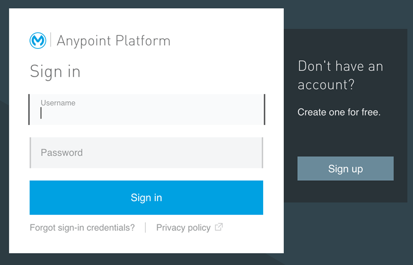

After you signed up, you are able to sign in and start to play around. The Anypoint Platform does not only provide an environment to design APIs, but also to manage and run them. Although, in this section we only concentrate on the design part.

#### Creating your first API

After you logged into your account, to create your first API you only have to follow these simple steps:

1. Press on the `API` menu on the top
2. Press on the `Add new API` button in the next window and fill in the mandatory information into the form
3. Confirm and press `Add` to create your first API

Following these three simple steps you should end up in your API Portal (see image below).

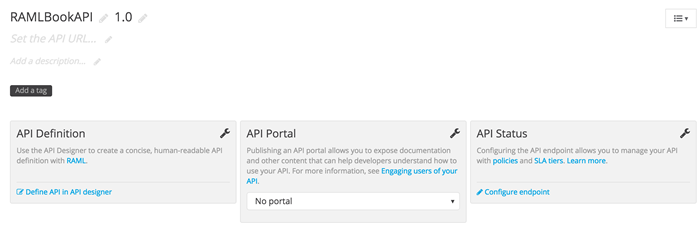

Use the first box and click on `Define API in API designer` to start designing your API in RAML.

#### Using the API Designer

The API Designer is divided into four different parts (see image below): a file explorer to navigate or organize multiple files associated to your API, the editor to design your API in RAML, a shelf that gives additional support to design your API, and the API Console to visualize the content of your API.

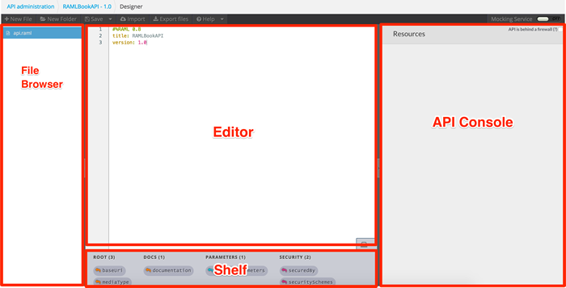

### API Workbench

In November 2015, MuleSoft released the API Workbench as an opensource tooling that give developers a rich, full-featured integrated development environment (IDE) for designing, building, testing, documenting and sharing RESTful HTTP APIs. The core of the API Workbench is Github’s Atom a text editor that is designed to be deeply customizable and extensible to a full-featured IDE building a unique experience for every developer. The API Workbench, different from the API Designer, is an IDE that can be used locally which comes with a lot advantages such as an easier integration of version control and collaboration tools.

#### Installing the API Workbench

To get started with the API Workbench, you'll need to get [Github’s Atom](https://atom.io/docs/v0.194.0/getting-started-installing-atom) on your system first. After you've done the installation, installing the API Workbench should be fairly simple. The easiest way is to use Atom's package manager that is installed by default. Go to `Preferences` in Atom's main menu (on Mac that is called Atom).

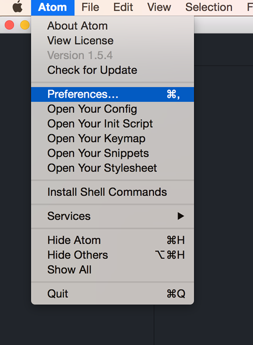


That opens an additional `Settings` tab with an option to `Install` new plugins. Choose that option and simple type in `api-workbench` to search for the plugin.

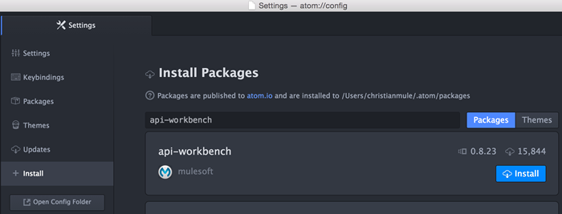

Now click on the `Install` button in your search result and wait until the installation process is done. This process is happening in the background and you will not get notified when finished. So just wait until you will find the `api-workbench` plugin under the list of installed packages.

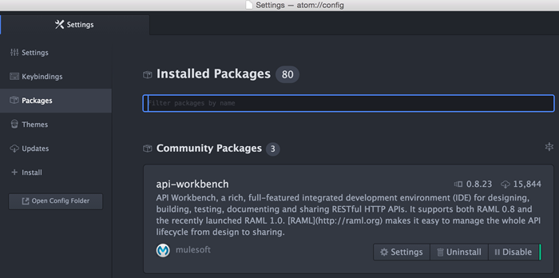

#### Creating your first RAML

After installing the API Workbench you should also have an additional menu entry in the `Packages` menu called `API Workbench`. It contains different features that will support developers with not only creating a RAML project from scratch, but also to obtain popular community APIs from an external Github repository; and more.

To create a project from scratch, simple click on `Create RAML Project` and fill in all necessary information before confirming using the `Create` button.

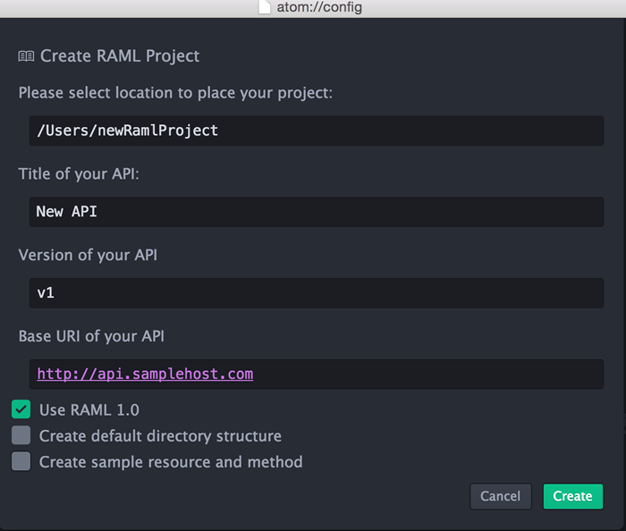

Depending on the information you put in, and let us assume the information are the same as in the image above, you should get a single **api.raml** file with the following content:


	#%RAML 1.0
	title: New API
	version: v1
	baseUri: http://api.samplehost.com


### RAML Basics

The nice thing about using a tool like the API Designer is that it will automatically prefill the required aspects of your RAML file for you.  These are the:
	- RAML and version declaration
	- Your API Title
	- The BaseUri for your API
	- The version of your API (ie version 1, 2, 4, etc)

To start the file off, we'll simply add `#%RAML` followed by the version of RAML that we are using, in this case 1.0:

	#%RAML 1.0

This tells the parser that this should be handled as a RAML file, and also what version of RAML so that the parser knows how to handle the different types of functionality (for example, many features available in RAML 1.0 are not available in RAML 0.8 - this tells the parser to take advantage of these features).

Once we have declared the file as a RAML file (as shown above) the next thing we need to do is give our API a title, such as `My API`:

	#%RAML 1.0
	title: My API

So far this has been pretty easy, right?  The next thing to add is our `baseUri`, or what the root domain and path for the API is.  This will be used by the majority of the tooling to tell your users where to make the calls, and even help them test their calls.  To add the `baseUri`, simply add it in like so:

	#%RAML 1.0
	title: My API
	baseUri: http://api.mydomain.com
	version: 1

Last but not least, we should declare what version of the API "My API" this is.  This will be used to help ensure developers know which version of the API they're using, as well as for all of your documentation.  This will also help you segment versions of your API for when you inevitably have to create a new version.

We do this by adding in the `version` property like so:

	#%RAML 1.0
	title: My API
	baseUri: http://api.mydomain.com
	version: 1

And there you go!  Just like that you have started off your RAML file.  The next part is adding in resources, methods, and properties - which the next few sections will walk you through.  The nice thing is, each aspect of RAML is as easy, and as clear-cut as the four items we declared above.

### Adding in a Default Media Type

Often, an API takes or returns a specific set of media types that 1) are the same across your API or 2) have the same information defined. Let us go through an example for the former case first.


	#%RAML 1.0
	title: My API
	baseUri: http://api.mydomain.com
	version: 1

	/users:
	  get:
    	responses:
      	  200:
        	body:
          	  application/json:
            	schema:
            	  # additional information about the response

    post:
      body:
        application/json:
          schema:
          # additional information about the request

    /{id}:
      get:
        responses:
          200:
          body:
            application/json:
                schema:
                # additional information about the response


By looking closer at the example above, it turns out that the API only uses the media type `application/json` to describe all of its request or responses. To reduce the amount of redundant information and to make this specific media type default across your API, RAML provides the `mediaType` property at the root-level of your API. Using that, our modified example would look like the following:


	#%RAML 1.0
	title: My API
	baseUri: http://api.mydomain.com
	version: 1

	mediaType: application/json

	/users:
	  get:
        responses:
          200:
            body:
              schema:
                # additional information about the response

      post:
    	body:
      	  schema:
      	    # additional information about the request

      /{id}:
        get:
          responses:
            200:
              body:
                schema:
                  # additional information about the response


In some cases, of course, you want to add an additional media type or not use the default. That can be achieved by simply define the media type explicitly on the request or response; where the default media type will be overridden and in case it is still required has to be defined explicitly again.


	#%RAML 1.0
	title: My API
	baseUri: http://api.mydomain.com
	version: 1

	mediaType: application/json

	/users:
	  get:
        responses:
          200:
            body:
              application/xml: # overrides default media type
                schema:
                  # additional information about the response
              application/json: # needs to be mentioned explicitly again
                schema:
                  # additional information about the response

      post:
        body:
          schema:
            # additional information about the request

      /{id}:
        get:
          responses:
            200:
              body:
                schema:
                  # additional information about the response


How simple and handy is that, right? You do not need to specify the media type within every body definition of a request or response. That greatly reduce the redundant information in your API definition and makes it very easy to change from one standard media type to another.

### Adding in Available Protocols

Just as you can define the available media types (content-types) for your API, you can also explicitly set the available protocols - most commonly HTTP or HTTPS.  This means that you can require a secure connection (HTTPS), make HTTP/S available, or add in additional protocols for your REST/ REST-like API across different protocols (although, RAML is based off of HTTP style APIs using HTTP methods and status codes).

To set the available protocols for the API simply add in the `protocols` property and define your protocols within a YAML Array like so:

	#%RAML 1.0
	title: My API
	baseUri: http://api.mydomain.com
	version: 1

	protocols: [HTTP, HTTPS]

Keep in mind that using the `protocols` property will override the protocol used in the baseUri property.  In other words, the following would require HTTPS even though the baseUri uses HTTP:

	#%RAML 1.0
	title: My API
	baseUri: http://api.mydomain.com
	version: 1

	protocols: [HTTPS]

Since this is an optional property, you really only need to use it when you do support multiple protocols, and want to explicitly share all the protocols you support.

###Creating Resources
Creating resources in RAML is as easy as writing down it's path.  For example, if we wanted to create an API with a `/users` resource, all we would need to type is `/users:` like so:

	#%RAML 1.0
	title: My API
	baseUri: http://api.mydomain.com
	version: 1

	/users:

Just like that we now have a `/users` resource:

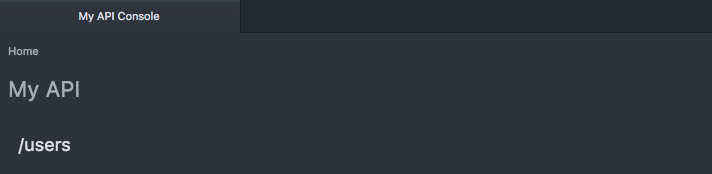

To add a description to our `/users` resource, we simply follow YAML conventions and add the `description` property:

	#%RAML 1.0
	title: My API
	baseUri: http://api.mydomain.com
	version: 1

	/users:
	  description: this is my users resource!  isn't this easy?!

And once again, just like that, the description is added to our resource:

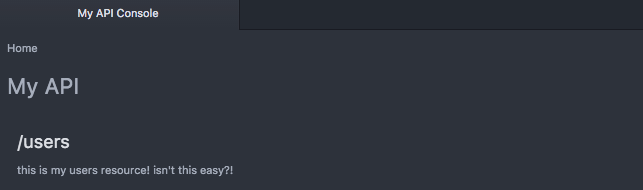

####URI Properties
To create more complex resources, or resources that utilize names or IDs, you can take advantage of URI properties, or placeholders within the resource.  To do this, simply tell the spec that your ID is a URI Property by placing curly brackets around it, like so:

	/users/{id}:

Just like that you can setup IDs or dynamic resource paths:

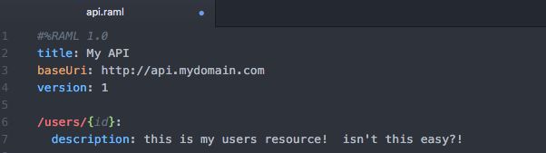

	EXPAND ON LIMITATIONS/ PATTERNS/ MULTIPLES

####Nested Resources
But another great feature of RAML is something called resource nesting, or creating child resources.  To add a nested resource, simply follow YAML convention by tabbing in once under the parent resource, and then declare your child resource as you did your parent resource - but with a relative path from the parent's path:

	#%RAML 1.0
	title: My API
	baseUri: http://api.mydomain.com
	version: 1

	/users:
	  description: this is my users resource!  isn't this easy?!

	  /{id}:
	    description: this is a nested dynamic resource using a URI property

As you can see, the `/{id}` resource is now a child of the parent resource.  This lets you define your API in a way that is efficiently organized, letting you quickly find all sub-resources under their parent.

However, it's important to note that the child resources inherit the parent path ONLY - and do not inherit any of parent's properties such as it's resourceType or methods, unless specifically specified in the child resource (as you did in the parent).

For example, if we look at this RAML snippet:

	#%RAML 1.0
	title: My API
	baseUri: http://api.mydomain.com
	version: 1

	/users:
	  get:

	  /{id}:

You'll notice that the resource `/users` has a `GET` method, however the child resource `/{id}` does not.  

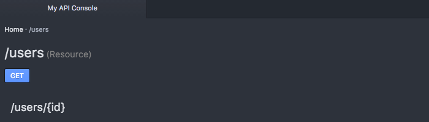

Again, this is because the child resource only inherits the path and not the properties of its parent.

###Creating Methods
Just as creating resources was as simple as declaring the path, adding methods is as simple as declaring the method:

	#%RAML 1.0
	title: My API
	baseUri: http://api.mydomain.com
	version: 1

	/users:
	  get:

Which in turn creates:

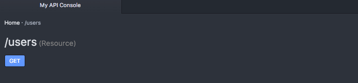

RAML supports `GET`, `PUT`, `PATCH`, `POST`, `DELETE`, `HEAD`, and `OPTIONS` although you'll want to be careful which ones you use as not all are official methods, and not all are supported by all servers.

It's also important to understand the difference between each of these methods as they all have VERY specific purposes with careful and well established standards surrounding them.  Refer to my other book, *[Undisturbed REST: a Guide to Designing the Perfect API](http://www.mikestowe.com/books)* if you're not sure how to properly use them.

Like with resources, you can add a description to your methods.  This is a perfect place to share what the method is and what it does, and can be used in generating documentation for your API.  

To add a description, simply use the `description` property:

	#%RAML 1.0
	title: My API
	baseUri: http://api.mydomain.com
	version: 1

	/users:
	  get:
	    description: this is my get method


####Querystring Parameters
Another common functionality with APIs is Querystring Parameters, or manipulating the response using the URI querystring.

RAML lets you document the different querystrings under the method they are being implemented under (hopefully this is the `GET` method!!!) by using the `queryParameters` property, like so:

	#%RAML 1.0
	title: My API
	baseUri: http://api.mydomain.com
	version: 1

	/users:
	  get:
	    description: this is my get method
    	queryParameters:

For each `queryParameter` you will simply need to declare the name of the parameter, keeping it consistent with how it is used within the URL.  So if our URL was `http://api.mydomain.com/users?status=active` we would call the query parameter "status" like so:

	#%RAML 1.0
	title: My API
	baseUri: http://api.mydomain.com
	version: 1

	/users:
	  get:
	    description: this is my get method
	    queryParameters:
	      status:

And as simple as that, we now have the `status` query parameter showing up in our API documentation:

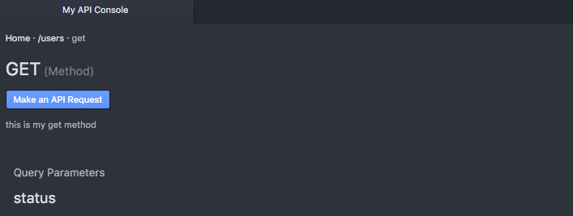

Of course, there is much more you can do with the query parameter, such as providing it's display name, a description, an example, the default value, whether or not it is required, and even it's type:

	#%RAML 1.0
	title: My API
	baseUri: http://api.mydomain.com
	version: 1

	/users:
	  get:
	    description: this is my get method
	    queryParameters:
	      status:
		    displayName: Status
			description: Status of the users to retrive (active, inactive, all)
			default: all
			required: false
			type: string


By providing this additional information, you are empowering your users as this information can be passed through to them in your documentation, as well as taken advantage of by other tools that parse your API's RAML spec.

####Form Data
One important change from RAML 0.8 to RAML 1.0 was the removal of the `formParameters` property.  This means when upgrading your RAML 0.8 file, you'll need to remove this property for your speficiation to be properly parsed.

Instead, form parameters are now treated identically to other content-types.

To add form data, first add in the `body` property to indicate you are requesting body data to be present in the request, followed by the appropriate content-type - in this case `multipart/form-data`.  Now you can add in your form properties using the `properties` declaration:

	#%RAML 1.0
	title: My API
	baseUri: http://api.mydomain.com
	version: 1

	/users:
	  post:
	    description: create a new user

	    body:
	      multipart/form-data:
	        properties:
	          firstName:
	            type: string

	          lastName:
	            type: string


####Body Data
More common than using form data for `PUT`, `PATCH`, and `POST` calls, however, is the use of a format like JSON or XML within the body.

RAML also lets you share examples of what the user should be sending when making these calls by using the `body` property, and then the corresponding content-type (as with form data):

	#%RAML 1.0
	title: My API
	baseUri: http://api.mydomain.com
	version: 1

	/users:
	  post:
	    body:
		  application/json:

Unfortunately, this really doesn't change the way our documentation works as we still have not provided WHAT the body should look like.

To do this we have two options, we can share a schema (more often used with XML) or provide an example of the data being shared.

Of course, if we'd like we can share both by using the corresponding properties:

	#%RAML 1.0
	title: My API
	baseUri: http://api.mydomain.com
	version: 1

	/users:
	  post:
        body:
		  application/json:
		    schema: |
			  {
			    "$schema": "http://json-schema.org/draft-04/schema#",
			    "id": "http://jsonschema.net",
			    "type": "object",
			    "properties": {
			       "name": {
			          "id": "http://jsonschema.net/name",
			          "type": "string"
			        },
			      "city": {
	 	            "id": "http://jsonschema.net/city",
				    "type": "string"
			      },
			      "state": {
			        "id": "http://jsonschema.net/state",
		            "type": "string"
		          }
				},
		   	    "required": [
			  	  "name",
			      "city", 				  	   
				  "state"
				]
			  }
		  	example: |
		  	  {
	  		    "name": "Mike Stowe",
		  	    "city": "San Francisco",
			    "state": "CA"
			  }

By providing both this lets us share with our users what the request should look like, as well as the specific information about what the request needs to include and how it should be formatted, something that again can be provided to them via your documentation and also used to generate auto-validating SDKs:

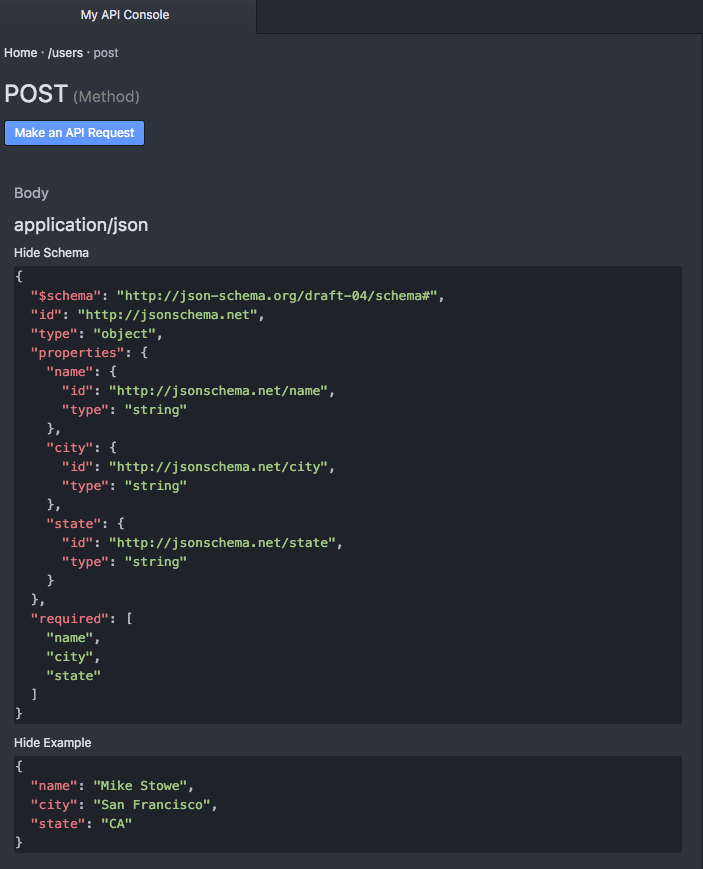

Of course, your API may support numerous content-types, which works fairly well with RAML, as all you have to do to add an additional content type is, well, add it (I'm removing schemas in this case to keep it short, but of course RAML supports multiple content-types having schemas):

	#%RAML 1.0
	title: My API
	baseUri: http://api.mydomain.com
	version: 1

	/users:
		post:
			body:
				application/json:
					example: |
						{
					  	  "name": "Mike Stowe",
					  	  "city": "San Francisco",
					  	  "state": "CA"
						}
				text/xml:
					example: |
						<user>
							<name>Mike Stowe</name>
							<city>San Francisco</city>
							<state>CA</state>
						</user>

As you can see, we now have multiple content types to choose from shown in our documentation:

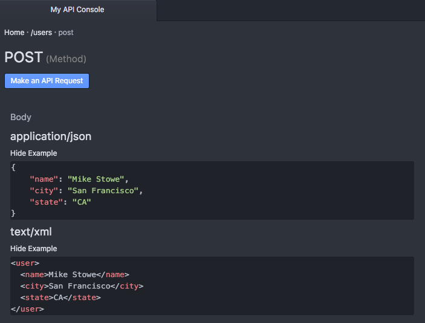

What's important to remember is that schemas describe the request content, where-as examples are "real-life demos" of what that formatted content would look like when being sent to your server via the content-type body.


###Handling Responses
RAML lets you easily describe all aspects of your API resource method's responses for multiple status codes including defining headers, content-types, schemas, and example responses.

To declare responses in RAML, simply use the `responses` property:

	#%RAML 1.0
	title: My API
	baseUri: http://api.mydomain.com
	version: 1

	/users:
		post:
			responses:

####Status Codes
As RAML is intended to describe HTTP REST APIs, responses rely on the standard HTTP status codes.

The most popular status codes are:

Status Code | Description | Generally Returned For
----------- | ----------- | ------------
**2xx** | **Successful** | Success
200 | The request was handled successfully | GET, PUT, PATCH
201 | A new object has been created | POST
204 | The request was successful, but there's no content to return | DELETE
**3xx** | **Redirection** | Redirects
301 | Resource or item moved permanently | ALL
304 | Nothing was modified by the request | PUT, PATCH
**4xx** | **Client Error** | Errors
400 | The request could not be understood by the server | ALL
401 | Not authorized to access or perform action | ALL
404 | The resource or item could not be found | GET
405 | The method attempted (GET, PUT, POST, etc) is not allowed | ALL
415 | The media type request (JSON, XML, etc) is not supported | ALL
**5xx** | **Server Error** | Errors
500 | The server experienced an unexpected error and could not complete the request | ALL

However, you can find a more detailed list in chapter 9 my book, "Undisturbed REST."

To setup responses for each status, use the status code as the key for the response, like so:

	#%RAML 1.0
	title: My API
	baseUri: http://api.mydomain.com
	version: 1

	/users:
		post:
			responses:
				201:
					# 200 - Object Created

				400:
					# 400 - Bad Request

				500:
					# 500 - Server Error

Which as you can see adds them to our API documentation for that method:

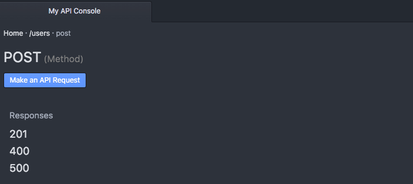

####Headers
Headers are used to transmit important information about the response, such as the location of newly created object.

Adding headers is as simple as using the `headers` property within the status code's response block.  Then add the name of the header (such as `location`) as the property.

	#%RAML 1.0
	title: My API
	baseUri: http://api.mydomain.com
	version: 1

	/users:
		post:
			responses:
				201:
					headers:
						location:
							#location data will go here
				401:
					# Not Authorized

Once you have defined the header by the property name you can add the following properties to each header property as necessary:

Property | Description
-------- | -----------
displayName | How to display the header in documenation
type | Data type of the header property such as string, integer, etc
example | An example of the type of data the header may return

For example:

	#%RAML 1.0
	title: My API
	baseUri: http://api.mydomain.com
	version: 1

	/users:
		post:
			responses:
				201:
					headers:
						location:
							displayName: Location
							type: string
							example: http://http://api.mydomain.com/users/109
				401:
					# Not Authorized

As you can see, this is then translated into our documentation for us:

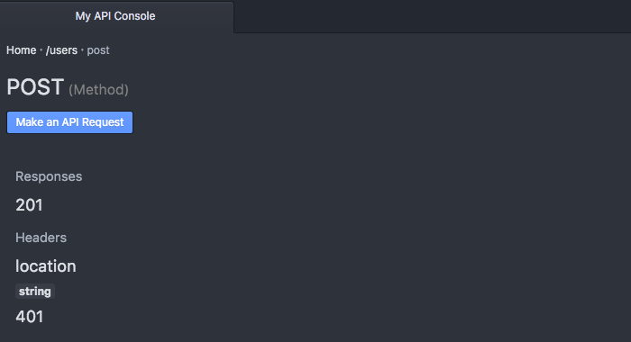

####Content Types
RAML also lets you define not just one, but multiple content types for each HTTP Status Response code.

This means that you can return back data as JSON, XML, plain text, form-encoded, or other formats.

To define a content type, first state that you are returning back body data by using the `body` property, and then use the associated content-type for that content type, like so:

	#%RAML 1.0
	title: My API
	baseUri: http://api.mydomain.com
	version: 1

	/users:
		post:
			responses:
				201:
					headers:
						# header information

					body:
						application/json:


To list multiple content types, you can simply add additional content types within the `body` section of the status code response data, like so:

	#%RAML 1.0
	title: My API
	baseUri: http://api.mydomain.com
	version: 1

	/users:
		post:
			responses:
				201:
					headers:
						# header information

					body:
						application/json:

						text/xml:

The next step to showing off these content types is adding in example response data so that we can see what they look like.

####Examples
A unique feature of RAML compared to some other specifications is the ability to create your own examples rather than forcing you to build a schema for the response.

Adding an example is as simple as using the `example` property.  However, because most examples are multi-lined, and because RAML is written in the YAML format, you'll need to add a pipe "|" so that it can be properly parsed.  

Another option, of course, is to include your example using `!include` which we will talk about in a later chapter.

	#%RAML 1.0
	title: My API
	baseUri: http://api.mydomain.com
	version: 1

	/users:
		post:
			responses:
				201:
					headers:
						# header information

					body:
						application/json:
							example: |
								{
									"response" : "data"
								}

						text/xml:
							example: |
								<response>
									data
								</response>

Now if we look at the API Console we can see multiple content types (one for JSON and one for XML) as well as the example response data for each:

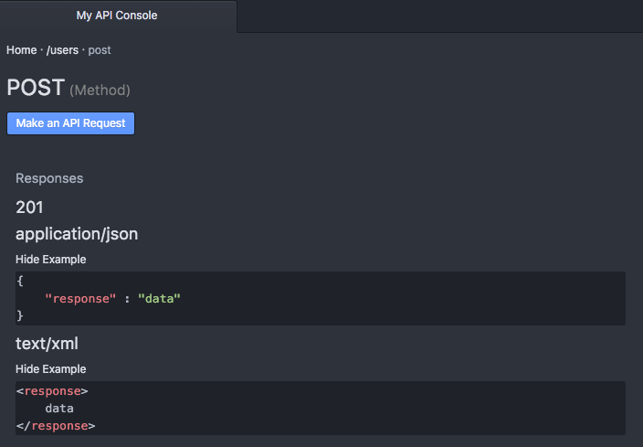

####Schemas
Schemas work very similarly to examples, except you need to use the `schema` property, like so:

	#%RAML 1.0
	title: My API
	baseUri: http://api.mydomain.com
	version: 1

	/users:
		post:
			responses:
				201:
					headers:
						# header information

					body:
						application/json:
							example: |
								{
									"response" : "data"
								}

							schema: |
								{
								  "$schema": "http://json-schema.org/draft-04/schema#",
								  "id": "http://jsonschema.net",
								  "type": "object",
								  "properties": {								     "response": {
								        "id": "http://jsonschema.net/response",
								        "type": "string"
								     }
								  },
								  "required": [
								    "response"
								  ]
								}


As you can see in the above example, RAML lets you explain your content types with examples, schemas, or both.

Now if we look in the API Console, while we still have the example, we can now see the schema for the application/json response body:

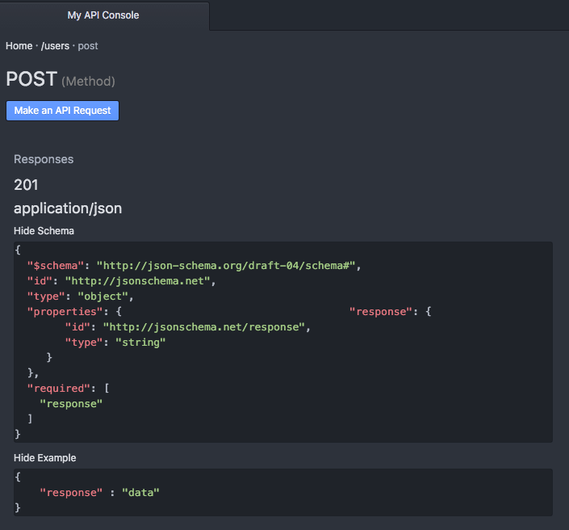

####Hypermedia
One of the most popular feature requests for RAML 1.0 was added support for hypermedia, or dynamically driven linking formats.

However, one of the problems with hypermedia is the fact that it can be so truly dynamic, meaning that there may not be a way to actually define what responses are available for which items as each can be so individualistic.

The other challenge with supporting hypermedia is the number of hypermedia specifications in the market.  For example, you have JSON API, HAL, JSON-LD, Collection+JSON, Siren, Uber, Yahapi, CPHL, and many more.

However, because hypermedia is represented in the body of the response, you are still able to describe a static representation of what types of links MAY be returned, as well as what hypermedia format you are returning.

For example, if we are using HAL (content type: application/hal+json) we can represent an example of its usage like so:

	/users:
		post:
			responses:
				201:
					headers:
						# header information

					body:
						application/json+hal:
							example: |
								{
									"field1" : "data",
									"field2" : "data",
									"field3" : "data",
									"_links" : {
										"self": { "href": "/users/1" },
										"messages": { "href": "/users/1/messages" },
									}
								}


####Error Handling
In order to assist developers in integrating and debugging your API, it's highly recommended to use a descriptive error format such as JSON API's error method, vnd.error, or Google Errors.

Because your error response should be specific to the call made by the user, it's not possible to describe all error possibilities inside of your RAML specification.  Instead, like with hypermedia, you can specifiy the response code and then provide an example of the error they might receive to help them better understand the model or response they might receive when something does go wrong.

Just like hypermedia, the sample error becomes part of our example response:

	/users:
		post:
			responses:
				400:
					headers:
						# header information

					body:
						application/json:
							example: |
								{
								  "error": {
								    "code": 400,
								    "message": "The user was missing required fields",
								    "errors": [
								      {
								        "domain": "global",
								        "reason": "MissingParameter",
								        "message": "User first name cannot be empty",
								        "locationType": "parameter",
								        "location": "firstName",
								        "extendedHelp": "http://docs.domain.ext/users/post" },
								      {
								        "domain": "global",
								        "reason": "MissingParameter",
								        "message": "User last name cannot be empty",
								        "locationType": "parameter",
								        "location": "lastName",
								        "extendedHelp": "http://docs.domain.ext/users/post"
								      }
								    ]
								  }
								}

You can learn more about descriptive error formats and their usage in my other book, Undisturbed REST: a Guide to Designing the Perfect API.

##3. Setting up Templates
Now that you have an idea of what your API resources will look like, RAML let's you setup includes and templates to allow for both code reuse and the implementation of design patterns.  This not only ensures that your API is consistent throughout, but also lets you organize your API to keep it easily readable by those working with the RAML spec.

It's important to remember that the benefits of code reuse and design patterns are both immediate and long-term.  While you may feel that you can build a consistent API, the patterns ensure consistency.  This especially becomes important as your API grows and newer developers start working with it - often times trying to implement new resources or methods without having a strong and full understanding of your entire API.

###Includes
The easiest of the templates to setup, the `!include` function lets you pull in external files, whether they be another RAML file, example response files, or schemas.

Using the !include file is as simple as:

	#%RAML 1.0
	title: My API
	baseUri: http://api.mydomain.com
	version: 1

	/resource:
		get:
			responses:
				200:
					body:
						application/json:
							example: !include examples/resource_get.json
							schema: !include schemas/resource_get.json

###Base
	I wish I was an oscar meyer weiner...

###ResourceTypes
ResourceTypes on the other hand let you create resource templates, or specific templates based on the type of resource, often split into item or collection.

For example, if you are performing an operation on a collection (usually the resource WITHOUT an ID) you can setup a resourceType so that all your collection based resources operate exactly the same (just with different data).

You can also do the same with your item resources (/resource/{ID}), again creating a specific template that ensures that all item resources look and feel the same way.

Another huge advantage of resourceTypes is that it lets you define all your possible responses in a single place, rather than having to repeat your general status code responses (200, 201, 301, 304, 401, 404, 405, 415, 500) for each of the individual resources.

	#%RAML 1.0
	title: My API
	baseUri: http://api.mydomain.com
	version: 1

	resourceTypes:
	  collection:
	 	get:
	 		description: this is a get method

	 	post:
	 		description: this is a post method

	 	delete:
	 		description: this is a delete method
	 		responses:	 		
	 			202:
	 				headers:
	 			304:
	 				body:
	 					application/json:
	 						example: |
	 							{"Response" : "Nothing Mofidied"}ers:
	 			401:
	 				body:
	 					application/json:
	 						example: |
	 							{"Response" : "Not Authorized"}
	 			405:
	 				body:
	 					application/json:
	 						example: |
	 							{"Response" : "Method Not Allowed"}
	 			415:
	 				body:
	 					application/json:
	 						example: |
	 							{"Response" : "Content-type Not Recognized"}
	 			500:
	 				body:
	 					application/json:
	 						example: |
	 							{"Response" : "Internal Server Error"}

	/users:
		type: collection

You'll noticed that the `/users` doesn't actually have any properties assigned to it other than `type: item`, but because it is of a known resourceType, all of the information will be automatically pulled into it for us:

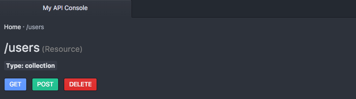

Including method properties:

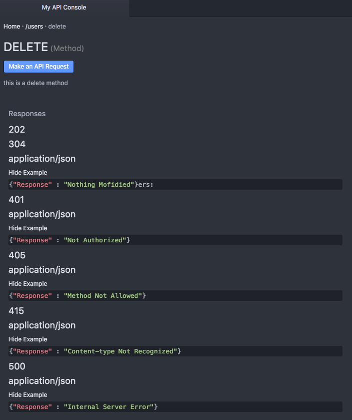

####Declaring Optional Methods
Of course, chances are you do not want ALL the information to be pulled in all of the time, in which case you can make methods OPTIONAL by adding a `?` to the end of the method name, like so:

	#%RAML 1.0
	title: My API
	baseUri: http://api.mydomain.com
	version: 1

	resourceTypes:
	  collection:
	 	get?:
	 		description: this is a get method

	 	put?:
	 		description: this is a put method

	 	post?:
	 		description: this is a post method

	 	delete?:
	 		description: this is a delete method

	/users:
		type: collection

Now the `/resource` does not have ANY properties being pulled in because we have declared all the methods to be optional, and to only be pulled in if explicitly called by the resource.

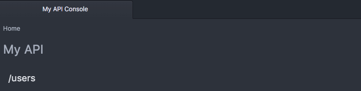

But the second we call in one of the properties, we now have it's description and any underlying properties that we would delcared:

	/users:
		type: collection
		get:

As you can see here:

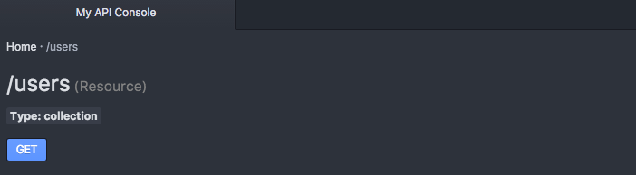

####Placeholders within ResourceTypes
Just as you probably do not want all methods in every resource, chances are you probably want different descriptions, examples, properties, and other data within your resources.

Keep in mind, that you can always override the resourceType by typing in the data again, or by not having the data wtihin your resource to begin with.

However, for properties that are consistent across your resources, it may be most efficient to take advantage of placeholders, or variables within the template that will be replaced by the placeholder value assigned by that resource once pulled in.

Placeholders within RAML are denoted by double less than and greater than signs, or `<<PLACEHOLDER>>`.

	#%RAML 1.0
	title: My API
	baseUri: http://api.mydomain.com
	version: 1

	resourceTypes:
	  collection:
	    get:
	      description: this is a get method
	      responses:
	        200:
	          body:
	            application/json:
	              example: |
	                <<exampleItem>>

As you can see from the code above, first we declare our placeholders in the resourceType itself, and then we specify the values in the calling resource, under that specific type:

	/users:
    	type:
      		collection:
        		exampleItem: |
		          {
		            "name": "Mike Stowe",
		            "city": "San Francisco",
		            "state": "CA"
		          }

These placeholders are automatically replaced with the correct data in our documentation:

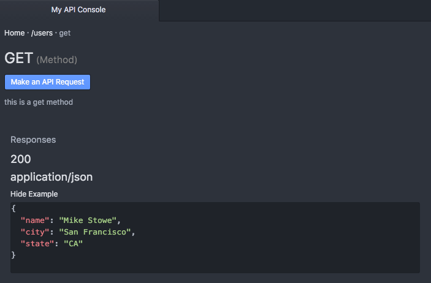

This allows us to ensure consistency not only in how our resources operate, but also in our documentation.  Making it easy for our developers to go from resource to resource, knowing that the code and the documentation will be consistent.

###Traits
Traits operate in a fairly similar fashion to resourceTypes except that they operate more as functions with the placeholder values being sent as properties in an array, and are designed specifically for use within the method (such as GET, PUT, PATCH, POST, or DELETE).

Traits are typically used for operations such as pagination, searching, or filtering the method data.

To delcare a trait, first we need to declare it at the top of our spec under the `traits` property:

	#%RAML 1.0
	title: My API
	baseUri: http://api.mydomain.com
	version: 1

	traits:
	  pageable:
	    queryParameters:
	      offset:
	        description: Skip over a number of elements by specifying an offset value for the query
	        type: integer
	        required: false
	        example: 20
	        default: 0
	      limit:
	        description: Limit the number of elements on the response
	        type: integer
	        required: false
	        example: 80
	        default: 10

And then we will pull it into our method using the `is` property:

	/users:
    	get:
      		is: [pageable]

Once the trait is successfully pulled in, we can see it within the API designer or in our documentation:

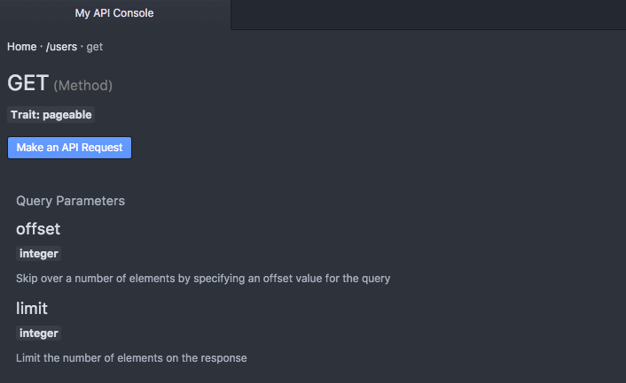

As mentioned, you can also take advantage of placeholders with traits by sending these values back in a key, value based array:

	#%RAML 1.0
	title: My API
	baseUri: http://api.mydomain.com
	version: 1

	traits:
	  filterable:
	  pageable:
	    queryParameters:
	      offset:
	        description: Skip over a number of elements by specifying an offset value for the query
	        type: integer
	        required: false
	        example: 20
            default: <<offsetDefault>>
          limit:
	        description: Limit the number of elements on the response
	        type: integer
	        required: false
	        example: 80
	        default: <<limitDefault>>

	/users:
      get:
        is: [
      	  filterable,
      	  pageable: {offsetDefault: 0, limitDefault: 20}
      	]

The biggest advantage of traits is that they ensure consistency in the way your methods are acted upon.  Remember in Chapter 1 where we talked about how easy it is for these inconsitencies to crop up, making APIs difficult to use (as you have to search one resource one way, but another a completely different way - or worse, the same resource different ways) - by using traits you are creating a sure way NOT to run into this issue and have such inconsistences across your API.

The other nice thing about traits is that you can apply mulitple traits to your methods, letting you pull in and utilize multiple types of functions as much or as little as needed.

###Libraries
As you start adding traits, resourceTypes, schemas, and examples, it's easy for your specifcation to become bloated.  Of course you can call all of these in with `!include` but you still are not able to take advantage of code reuse at scale.

One of the new features of RAML 1.0 is libraries, or the ability to call in parts of your specification in a namespaced scope - meaning that you can pick and choose which of these items to apply to your spec.

This is particularly helpful if you have multiple APIs that share common themes (`/users` for example).

To pull in a namespaced library, you'll first want to create a library file.  We declare that a RAML specification is only to be used as a library by adding "Library" to the top of the file, like so:

	#%RAML 1.0 Library

By adding this line, we are telling the RAML spec to treat this file as a class, and not as an independent RAML specification.

Let's move our resourceTypes and Traits into this file:

	#%RAML 1.0 Library
	resourceTypes:
	  collection:
	    get:
	      # Get method goes here
	    post:
	      # Post method goes here
	    delete:
	      # Delete method goes here

	traits:
	  filterable:
	    #Filterable trait goes here
	  pageable:
	    #Pageable trait goes here

Now to call in this library, we will again pull it in using the `uses` property and the `!include` command:

	#%RAML 1.0
	title: My API
	baseUri: http://api.mydomain.com
	version: 1

	uses:
	  users: !include libraries/users.raml

	/users:		  
	  get:

However, at this point nothing is being applied to the resource or the method.  If we try to apply the "collection" resourceType as we did before, the result will be an error:

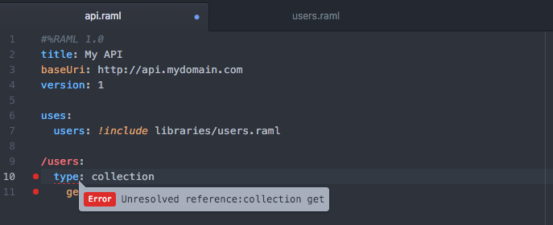

The reason for this is that the resourceType "collection" doesn't exist!  Instead, it is part of the `users` object that we declared above, and as such to utilize that resourceType we have to call it with respect to its parent's name, like so:

	#%RAML 1.0
	title: My API
	baseUri: http://api.mydomain.com
	version: 1

	uses:
	  users: !include libraries/users.raml

	/users:
	  type:
	    users.collection
	  get:

As you can see, now the resourceType users.collection has been applied to our resource:

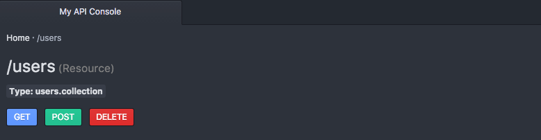

By having your resourceTypes, traits, schemas, and examples namespaced, you are able to prevent collisions and only use the components of a library that you choose - keeping your specification clean, and your code reusable.

###Overlays & Extentions
Overlays and Extensions allow another type of code reuse, by letting you create one specification and then "overlay" it with another to meet specific conditions or requirements without having to duplicate or modify your original spec.

For example, if your company has development, QA, and production environments - the configurations for each environment (such as the BaseUri) might be different.  Before, in RAML 0.8, to accomplish this you would need to duplicate your specification for each environment - increasing the odds of bugs or differences between the different "environment specific" specifications.  But with RAML 1.0, you only need to create a small snippet of RAML that you can then use to "overlay" the single specification the three environments will share - helping ensure the overall specification is the same in all environments.

#### Overlays (Add in Titles, Descriptions, Etc.)
Overlays are used to provide additional information such as descriptions or annotations to an existing specification without changing functionality.  To create an overlay, we simply append `#%RAML 1.0` with the keyword `Overlay` and then reference the RAML specification it extends like so:

	#%RAML 1.0 Overlay
	usage: Technical Documentation
	extends: api.raml

	/users:
	  displayName: Users
	  description: Adding in technical documentation for the /users resource

	  get:
	  	displayName: Get Users
	    description: Adding in technical documentation for the get method


As you can see, by using an overlay we are easily able to update or provide documentation for specific environments (such as adding in private or partner resources not available to the general public).


But again, when using the `Overlay` keyword we're not able to change any functionality, such as overwriting resouces, methods, or the baseUri.

	#%RAML 1.0 Overlay
	usage: Developer Environment
	extends: api.raml

	baseUri: http://dev.api.mydomain.com

Trying to do so instead returns back an error:


#### Extensions (Modify Functionality)
Instead, to change functionality we will want to use the `Extension` keyword, explicitly telling the RAML parser that we want to overwrite functionality as well.   This will let us override resources, methods, and even the baseUri - letting us cater to the requirements of each of our different environments such as dev, QA, and production - as well as different aspects of functionality our API may make available for partners or internal developers.

	#%RAML 1.0 Extension
	usage: Developer Environment
	extends: api.raml

	baseUri: http://dev.api.mydomain.com

As when using the `Overlay` declaration the original RAML spec is merged in, being overwritten by any updates we place in our overlay:


Overlays are also a great way to keep vendor specific declarations, or annotations, separate from your master RAML specification - letting you meet your vendors needs or provide additional information without cluttering up your specification.

###Annotations
Also new in RAML 1.0, annotations are designed to allow for vendor specific properties to be placed within your RAML specification, or preferably within an overlay that pulls in your standardized specification.

This means that your RAML specification can be expanded upon to provide any unique information vendors or third service solutions might require, but in a way that doesn't impact the rest of your specification - and can even be separated from your primary RAML specification.

To use annotations, we need to first declare the annotations within our spec, or in this case, within an overlay:

	#%RAML 1.0 Overlay
	usage: Developer Environment
	extends: api.raml

	annotationTypes:
      partnerClearanceLevel: enum[low, med, high]


Once they have been declared, we can now place them in our resources and methods like any other property, denoting they are an annotation by surrounding the key in parenthesis, like so:

	#%RAML 1.0 Overlay
	usage: Developer Environment
	extends: api.raml

	annotationTypes:
      partnerClearanceLevel: enum[low, med, high]

    /users:
      get:
        (partnerClearanceLevel): low

Because annotations are vendor specific, you will won't see any changes in the API Console, but they are now avaialble for the solutions you provide them to (again preferably in an overlay).


##4. Using Data Types
TBA

###Defining Types
TBA

###Built in Types
TBA

###Using Existing Schemas
TBA

##5. Security
Securing your APIs is as critical as letting your consumers know what mechanism you use to protect your API. RAML 1.0 allows you to define the most common security schemes and additionally lets you declare your own custom to fit all your needs. You then apply those schemes either on the complete API which tells consumers that you use specific mechanism across your API, or on specific resources and HTTP methods.

To be able to apply one or more security schemes, we need to first declare it at the top of our spec under the `securitySchemes` property:

```yaml
#%RAML 1.0
title: My API
baseUri: https://api.mydomain.com
version: 1

securitySchemes:
  private:
    description: |
      My API supports OAuth 2.0 for authenticating all API requests.
    type: OAuth 2.0
    describedBy:
      headers:
        Authorization:
          description: |
             Used to send a valid OAuth 2 access token. Do not use
             with the "access_token" query string parameter.
          type: string
      queryParameters:
        access_token:
          description: |
             Used to send a valid OAuth 2 access token. Do not use with
             the "Authorization" header.
          type: string
      responses:
        401:
          description: |
              Bad or expired token. This can happen if the user or my API
              revoked or expired an access token. To fix, re-authenticate
              the user.
        403:
          description: |
              Bad OAuth request (wrong consumer key, bad nonce, expired
              timestamp...). Unfortunately, re-authenticating the user won't help here.
    settings:
      authorizationUri: https://api.mydomain.com/1/oauth2/authorize
      accessTokenUri: https://api.mydomain.com/1/oauth2/token
      authorizationGrants: [ authorization_code, implicit ]
```

And then we are able to apply it, for example, on a specific resource using the `securedBy` property:

```yaml
/users:
  securedBy: [ private ]
```

The type of your security scheme is indicated by the `type` property. RAML 1.0 supports the following built-in types:

* OAuth 1.0
* OAuth 2.0
* Basic Authentication
* Digest Authentication
* Pass Through
* x-{other}

The following sections explain each in more detail.

###Basic Auth
The "Basic Authentication" authorization is based on the model that the client must authenticate itself with a user-ID and a password. The client sends both information as uncrypted base64 encoded text and therefore should only be used with HTTPS, otherwise the password can be easily captured and reused.

The following examples shows how to define a Basic Authentication security scheme in RAML:

```yaml
#%RAML 1.0
title: Basic Authentication Secured API
version: 1

securitySchemes:
  basic:
    description: |
      This API supports Basic Authentication.
    type: Basic Authentication
```

You can protect any resource or HTTP method with Basic Authentication by configuring `securedBy` and referencing back to your security scheme.

```yaml
/users:
  securedBy: [ basic ]
```

A server that receives an unauthenticated HTTP request for a protected resource (eg `/users`) can force Basic Authentication by rejecting the request with a 401 status code with additional information that describes the authentication mechanism, in our case `Basic`, and the security scope using `realm`. The following is an example if you send an anonymous request to our `/users` resource:

```
HTTP/1.1 401 Access Denied
WWW-Authenticate: Basic realm="Members only"
Content-Length: 0
```

Most web browser will display a login dialog when it receives this response, allowing the user to enter the user-ID and password. The browser sends this information again with an Authorization header:

```
GET /users HTTP/1.1
Host: api.mydomain.com
Authorization: Basic YWRtaW46YWRtaW4=
```

The Authorization header specifies the authentication mechanism followed by a simply base64 encoded version of <user-ID>:<password>. In our example, we encoded "admin:admin" which everyone can easily decode again.

###Digest Auth
Digest Authentication, compared to Basic Authentication, does not require the client to send the user-ID and password across the wire in an unencrypted form. Instead, the server sends the client a generated one-time to use string (also called a nonce value). The client combines that value with the user-ID, realm, and the password; and runs those fields through an MD5 hashing method to produce a hash key.

The client sends the produced hash key to the server along with the user-ID and realm to authenticate itself.

The following examples shows how to define a Digest Authentication security scheme in RAML:

```yaml
#%RAML 1.0
title: Digest Authentication Secured API
version: 1

securitySchemes:
  digest:
    description: |
      This API supports DigestSecurityScheme Authentication.
    type: Digest Authentication
```

You can protect any resource or HTTP method with Digest Authentication by configuring `securedBy` and referencing back to your security scheme.

```yaml
/users:
  securedBy: [ digest ]
```

Now, if a server receives an unauthenticated HTTP request to access `/users`, it responds with a 401 status code and additional information inside the WWW-Authenticate header like the authentication mechanism used (eg Digest), the security scope using `realm`, and the generated one-time string for the client.

```
HTTP/1.1 401 Access Denied
WWW-Authenticate: Digest realm="Members only",
  nonce="LHOKe1l2BAA=5c373ae0d933a0bb6321125a56a2fcdb6fd7c93b"
Content-Length: 0
```

A web browser that receives the response from a server will prompt for a user-ID and password. Once both are supplied, the client resends the same request but adds an `Authorization` header that includes all necessary information to authenticate the user.

```
GET /users HTTP/1.1
Host: api.mydomain.com
Authorization: Digest username="admin",
  realm="Members only",
  nonce="LHOKe1l2BAA=5c373ae0d933a0bb6321125a56a2fcdb6fd7c93b",
  uri="/users",
  response="876f419ed86d25c56d78d3851eae5e86"
```

The Authorization header specifies the authentication mechanism followed by the user-ID (username), the realm, the nonce value provided by the server, the URI, and the MD5 hash generated by the client.

Digest Authentication might have its advantages compared to Basic Authentication, since it does not use the password directly which makes it harder for Hackers to restore it, but it got other security trade-offs. For example, a man-in-the-middle attacker could tell clients to use Basic Authentication instead since Digest does not provide a mechanism for clients to verify the server's identity. 

###OAuth 1
The OAuth 1.0 authentication follows the standard described in RFC5849. The following example shows how to set properties for OAuth 1.0 in RAML:

```yaml
#%RAML 1.0
title: OAuth 1.0 Secured API
version: 1

securitySchemes:
  oauth_1_0:
    description: |
      OAuth 1.0 continues to be supported for all API requests, but OAuth 2.0 is now preferred.
    type: OAuth 1.0
    settings:
      requestTokenUri: https://api.mysampleapi.com/1/oauth/request_token
      authorizationUri: https://api.mysampleapi.com/1/oauth/authorize
      tokenCredentialsUri: https://api.mysampleapi.com/1/oauth/access_token
      signatures: [ 'HMAC-SHA1', 'PLAINTEXT' ]
```

###OAuth 2
The OAuth 2.0 authentication follows the standard described in RFC6749. The following example shows how to set properties for OAuth 2.0 in RAML:

```yaml
#%RAML 1.0
title: OAuth 2.0 Secured API
version: 1

securitySchemes:
  oauth_2_0:
    description: |
      My API supports OAuth 2.0 for authenticating all API requests.
    type: OAuth 2.0
    describedBy:
      headers:
        Authorization:
          description: |
             Used to send a valid OAuth 2 access token. Do not use
             with the "access_token" query string parameter.
          type: string
      queryParameters:
        access_token:
          description: |
             Used to send a valid OAuth 2 access token. Do not use with
             the "Authorization" header.
          type: string
      responses:
        401:
          description: |
              Bad or expired token. This can happen if the user or my API
              revoked or expired an access token. To fix, re-authenticate
              the user.
        403:
          description: |
              Bad OAuth request (wrong consumer key, bad nonce, expired
              timestamp...). Unfortunately, re-authenticating the user won't help here.
    settings:
      authorizationUri: https://www.myapi.com/1/oauth2/authorize
      accessTokenUri: https://api.myapi.com/1/oauth2/token
      authorizationGrants: [ authorization_code, implicit, 'urn:ietf:params:oauth:grant-type:saml2-bearer' ]
```

###Pass Through
Pass Through authentication is a mechanism where the server delegates an authentication request to a domain controller. The following examples shows how to define a Pass Through security scheme in RAML:

```yaml
#%RAML 1.0
title: Pass Through Secured  API
version: 1

securitySchemes:
  passthrough:
    description: |
      This API supports Pass Through Authentication.
    type: Pass Through
    describedBy:
      queryParameters:
        query:
          type: string
      headers:
        api_key:
          type: string
```

The Pass Through authentication does not require any special settings compared to an OAuth security scheme.

###Custom Auth
Sometimes, you have very specific security requirements that cannot be mapped directly to one of the existing security types. In this case, RAML 1.0 gives you the ability to define a custom security type that you can match to your needs. The following examples shows how to define a custom authentication security scheme using `x-{name}` as the type:

```yaml
#%RAML 1.0
title: Custom Auth Secured API
version: 1

securitySchemes:
  custom_scheme:
    description: |
      A custom security scheme for authenticating requests.
    type: x-token
    describedBy:
      headers:
        SpecialToken:
          description: |
            Used to send a custom token.
          type: string
      responses:
        401:
          description: |
            Bad token.
        403:
```

Custom authentication schemes do also not have any requirements for defining specific settings.

##6. Community Tooling
One of the strengths of RAML is the fact that the specification is surrounded by a very active open source community, while also being supported by some of the leading enterprises - ensuring a large selection of tooling to help you in all aspects of the API lifecycle.

You can find the latest list of all available tools (and languages supported) on the official RAML website at http://raml.org/projects.

However, here is a quick list to help you get started, divided by key areas of the continous API lifecycyle: design, build, test, document, and sharing your API.

###Design
####API Designer
####API WorkBench
####Editor Plugins
#####vim-raml
TBA

#####RAML Sublime Editor
TBA

#####RAML Syntax Highlighting for Visual Studio
TBA

####More Tools
######Restlet Studio
TBA

######Stoplight
TBA

###Build
To assist in building your API, there are several open-source projects to choose from.  While there are far too many languages and projects to list, here are just a few of the more popular projects to-date.

####JavaScript
#####Osprey
Osprey is a JavaScript framework for rapidly building applications that expose RAML APIs. It’s based on Node and Express.

####Java
#####Restlet
With Restlet Framework's powerful routing and filtering capabilities, unified client and server Java API, developers can build secure and scalable RESTful web APIs. It is available for all major platforms (Java SE/EE, Google AppEngine, OSGi, GWT, Android) and offers numerous extensions to fit the needs of all developers.

#####RAML for JAX-RS
The goal of RAML for JAX-RS is to provide a set of tools to work with these technologies in a way of being able to scaffold a JAVA + JAX-RS application based on an existing RAML API definition (Code Generation), or its roundtrip, generate the RAML API definition based on an existing JAVA + JAX-RS application (Documentation).

#####Spring MVC - RAML Spec Synchroniser
TBA

#####RAML Maven Plugin
TBA

#####Play-RAML
TBA

####PHP
#####PSX Framework
TBA

#####API2Symfony Bundle
TBA

#####Gointegro
TBA

####Python
#####FLASK-RAML
Flask-RAML (REST API Markup Language) generates an API server with parameter conversion, response encoding, and examples.

#####raml-python
RAML-python uses NodeJS to generate a framework for your API in Python.

#####RAMSES
TBA


####Integration Frameworks
#####MuleSoft

###Test
####Community Projects
#####Abao
Abao is a NodeJS command-line tool for testing API documentation written in RAML format against its backend implementation. With Abao you can easily plug your API documentation into the Continuous Integration system like Travis CI or Jenkins and have API documentation up-to-date, all the time. Abao uses Mocha for judging if a particular API response is valid or if is not.

#####Vigia
Vigia is a adaptable API integration test suite which supports test generation based on a RAML definition file.

#####Postman
Postman is one of the most popular API calling and testing tools used by developers today.  Freely available as a Chrome app, Postman supports API calls to any RESTful API and lets you setup scripts and tests after importing your RAML spec.  You can learn more about Postman at http://www.getpostman.com

####Paid Services
#####API Fortress
API Fortress provides testing by checking latency and response speeds within your API.  With API Fortress you can also validate responses and payloads to ensure that whether in dev or production your API is functioning correctly.  On top their services, API Fortress offers their own API - letting you test your API on demand.  Learn more about API Fortress athttp://apifortress.com/

#####API Metrics
TBA

#####API Science
API Science offers worldwide monitoring and testing of your API to identify performance issues, outages, errors.  With API Science you’re able to test multiple aspects of your HTTP based REST API including JSON, OAuth, and XML.  You can even test real, advanced CRUD sequences in production and receive alerts via Slack, PagerDuty, or via webhooks.  Learn more about API Science at https://www.apiscience.com/

#####Parasoft
TBA

#####SmartBear
SmartBear offers a large suite of testing tools for your API, letting you pull in your RAML spec to identify latency/ speed issues, errors, and verify response data.  Along with API Readiness tools, they also offer API Virtualization, Continuous Integration tooling, and Performance testing.  Learn more about SmartBear at http://smartbear.com/

####Other Tools
#####Paw
TBA


###Document
####API Console
TBA

####API Notebook
TBA

####RAML to HTML
TBA

####RAML to HTML for PHP
TBA

###Share
####APIMatic.io
TBA

####REST United
TBA

###Build Your Own
	Talk about Parsers and contributing :)


##7. Spec Driven Development
Spec Driven Development isn't part of RAML itself, but is a methodology that lets you incorporate design and development best practices, while ensuring you get the most out of your RAML spec.

Sometimes companies and project managers are adverse to the idea of contract driven design as they instantly jump back to their struggles in meeting deadlines and producing a viable product with the infamous Waterfall Methodology.

However, Spec Driven Development is not Waterfall or even Document Driven Design.  Instead, Spec Driven Development is designed to take best from all worlds, letting you establish a contract while incorporating agile sprints!

So if Spec Driven Development isn't waterfall, what is it?

###What is Spec Driven Development
Put simply Spec Driven Development is taking two agile processes and forcing them to work together.

The first agile iteration is the creation of a design - or a process that incorporates agile user testing and careful reviews to ensure that the contract or spec you create is *nearly* flawless.

This process is done in agile iterations, and can usually be accomplished in a matter of two to three weeks.

The next process is development.  But how does it differ from Waterfall in this case?  Unlike Waterfall, you still use agile iterations and Test Driven Development to ensure that the parts of the API you are building meet your customers' needs.  You can even change the design still - HOWEVER this requires going back and fool-proofing the design by testing it and taking advantage of user testing to ensure that once again all the bugs are out.

Essentially, the flow looks something like this:

In the design stage you are creating a spec, mocking it out, getting user feedback, and validating or making changes to that spec:


Once you have a strong spec, one where you are confident it is consistent and your users have helped you rid yourself of a majority of the flaws (this means having a group of 20 or more outside developers provide feedback) you would then move into the development cycle, which is a one-way road UNLESS you find defects in which case you again go back to the design cycle in order to test them:


This in essence gives you the benefits of Waterfall with the power of Agile - a unique combination that APIs require as once your API goes into production it is too late to change the contract (something you can usually do with web applications making pure agile ideal).

And while it may seem like an added step, by implementing Spec Driven Development you'll be able to identify the very flaws and inconsistencies that would otherwise doom your API, greatly shortening it's life cycle and rending all of your hard work useless!


###The Constraints of Spec Driven Development
Spec Driven Development is language/ tool agnostic, and can be used with any other API spec (such as Swagger or API Blueprint), but in order to be succesful, the Spec must be:

1. **Standardized** – Use of a standardized spec related to the type of application you are building

2. **Consistent** - The spec should remain consistent throughout in operations, utilizing consistent design patterns.

3. **Tested** - Agile development of the spec, incorporating repeated user feedback with a long-term focus in mind

4. **Concrete** – The creation of a complete, foundational spec to be used for your application

5. **Immutable** – Coding to the Spec without deviation

6. **Persistent** – The spec is not changed without strong reason and careful testing


####Standardized
Spec Driven Development encourages the use of a standardized format applicable to the type of application you are building.  In the case of building an API for example, the following specs would be considered standard, or common among the industry: RAML, Swagger, API Blueprint, IO Docs.

Utilizing a standard spec ensures easy portability among developers, while also ensuring that the spec your application relies on has been thoroughly tested by the community to ensure that it will meet both your short-term and long-term needs while maintaining consistency in its own format.

#####Consistent
In developing your spec you should utilize pattern driven design as well as code reuse when possible to ensure that each aspect of your spec is consistent.  In the event of building an API, this would mean ensuing your resources are all formatted similarly and your methods all operate in a similar format – both in regards to the request and available responses.

The purpose of consistency is to avoid confusion in both the development, and use of your application as all aspects of the application work similarly providing the end user with the freedom to move seamlessly from one focus to another.

####Tested
Spec Driven Development requires a strong, tested spec in order to build a reliable application.  This means that the spec has to be carefully crafted and then tested with both internal and external uses to ensure that it accomplishes its goals, and meets all parties needs.

The spec should be crafted, mocked/ prototyped, and tested to retrieve user feedback.  Once user feedback is received, the spec should be modified appropriately, mocked, and tested again- creating a continuous cycle until you have perfected the spec – or at the least eliminated a large majority of the design issues to ensure spec and application longevity.

####Concrete
The specification should be the very foundation of your application, or in essence the concrete foundation of the house you are building.  The spec should encompass all aspects of your application, providing a solid blueprint that your developers can code to.  The spec does not have to encompass future additions, but should have taken as many of them into consideration as possible.  However, there is nothing that relates to the spec that is coded outside of existing inside of the spec.

####Immutable
The spec is the blueprint for development and is unchangeable by code.  This means that at no time is the code to deviate from the spec, or to override the spec.  The spec is the ultimate authority of the application design, being the aspect that has been most thought-out and carefully designed and tested by real-world users.  It is important to realize that short-term coding implementations can be detrimental to an application’s longevity, and as such have no place in spec driven development.

####Persistent
All things evolve, and the application and spec are no different.  However, each evolution must be just as carefully thought out as the original foundation.  The spec can change, however each change must be justified, carefully evaluated, tested, and perfected.  In the event of development, if the spec is found to be not renderable, it is important to go back and correct the spec, re-engaging in user testing and validation, and then updating the code to match to ensure that your code is consistent with your spec while also ensuring that the necessary changes do not reduce the longevity of your application.


###The Benefits of Spec Driven Development
Once again, by choosing a spec such as RAML, and implementing Spec Driven Development you are setting yourself up for success, and letting your developers develop fearlessly (as they no longer have to make things up as they go, or try to look things up and learn in "real time").

Here are just some of the benefits that implementing Spec Driven Development provides:

- It provides a clear path for developers, letting them do what they do best, Code

- It ensures best practices as forced by RAML and other specs

- It interjects user testing at the beginning of the development lifecycle, saving you time and money with invaluable testing and feedback from your real-world users

- It forces long-term thinking and planning to avoid backwards incompatibilities, while also encouraging pattern based design to help reduce discrepancies in the consistency of the application

- Allows for parallel development of dependencies based on prototypes, expediting the ability to release to production (ie you can start building your mobile app based on the prototype before having completed the code necessary to make your API functional)

- Enables the use of open source communities and tools surrounding the spec, providing you with a strong community to learn from and freely available tooling that can save you thousands


##8. Putting it all Together
Now that we have a strong understanding of how RAML works, we can create a fairly large and complex API in very little time, and keep it not only organized, but easy to read and edit for our technical writers!

Then once the API is done, we can create a myriad of tools around it for our community to take advantage of - from API Notebooks, to documentation, to SDKs, to status notifiers, to so much more!!!

Let's get started by taking a real world API and showing how simple it is to keep it organized and readable.

For our example, we'll be creating one of many APIs that are derived from our base platform, having both shared principles (design styles, objects) as well as properties that will be unique to the specific area of the platform the API is being designed for - in this case, our invoicing system.

###Our Structure
We'll start off by creating a file structure designed to keep our RAML specification easy to read, and easy to edit.  Since we will be taking advantage of data types, libraries, overlays, and more - we'll split it into the following folder structure:

	- root
		- source
		- libraries
			- global

Inside of our libraries directory we can also create a Git-based global directory to automatically pull in libraries shared across multiple APIs.

	- root
		- libraries
			- global

If you will be pulling in older schemas or examples from a RAML 0.8 API (or others you've defined) you will also want to create folders for your schemas and/or examples, as well as sub-folders for each content-type:

	- root
		- schemas
			- json
			- xml
		- examples
			- json
			-xml

However, since we will be relying on Data Types for our API, we will omit the schemas and examples folders from our example structure.

The key to the structure is ensuring that every aspect of your API has a place, and that you avoid clutter/ combinging too many things in the same place.  While this takes a little bit more work to setup, it will ensure your API will remain readable, and easy to modify as new developers join your team.

And if you have a separate documentation/ technical writing team, you can also add in one more directory for docs - or the directory that will contain an overlay just for your technical writers to ensure that there are no accidental changes to your master or source specification.

	- root
		- docs

This means that for this RAML definition, our structure will look like:

	- root
		- source
		- libraries
			- global
		- docs

We will use the `root` folder to store our overlays for easy consumption, the `source` directory to host our master or source specification, the `libraries` directory to store our library files, including a directory for shared or global libraries, and finally the `docs` folder for our docs team to be able to go in and update the documentation without worrying about functionality.


###Creating our Libraries
For our invoicing API, we'll first focus on the global properties, creating (or bringing in if already created) libraries for our API's design, as well as the global users object library, and the global products object library.  These libraries will of course be stored in the `libraries/global` directory.

#####Global Designs Library (resourceTypes, Traits)

#####Global Users Object Library

#####Global Products Object Library

####API Specific Libraries
Now we can focus on creating API specific libraries, or in this case the objects specific to our invoicing API, such as an invoice object.  While the other libraries were stored in the global directory, unless other APIs will utilize this library we can keep it local, in the base of the `libraries` folder itself.

#####Invoice Object Library

###Creating our Master Specification
Now that we have our global libraries and API specific libraries in place we can now start focusing on building our master specification, or the specification that will serve as the source for our dev, QA, and production overlays.  This master or source specification will go in the `source` directory.

Because we already have the libraries defined, we are now able to quickly pull in these objects and examples, eliminating a lot of extra work, and creating a template for our developers to work off of, ensuring consistency.

As an added benefit, because this is our source specifcation, we can skip the `baseUri`, instead placing that in our extensions to force using the specific extension required instead of the source RAML directly.

###Adding in Overlays & Extensions

###Adding in Annotations

###Beyond the Specification

####Generate our Unit Tests

####Build the API

####Generate the Documentation

####Generate SDKs

###The Finished Product

##More Resources
Hopefully after reading this book you have a solid foundation of what RAML is, and how to take advantage of it.  But RAML is only one small piece of the puzzle, and there is so much more to learn.

I would encourage you to continue learning about how RAML can benefit you, as well as read up on API Best practices to ensure that your API provides the best experience to your users as possible, while also staying flexible enough to meet the demands of your business and platform for the next several years.

You can find more information and resources on RAML at **[http://raml.org]()** and on my own website, **[http://mikestowe.com]()**.

For more information on API Design and Best Practices, I would urge you to check out my book **[Undisturbed REST: a Guide to Designing the Perfect API](http://www.mikestowe.com/books)** available for download at [http://mulesoft.com/restbook]() or for purchase at Amazon.com.

Of course, there are many great books on API design, and of the many out there I would also personally recommend:

- **Irresistible APIs**, *Kirsten Hunter*, 2016, Manning Productions

- **API Architecture: The Big Picture for Building APIs**, *Matthais Biehl*, 2015

- **RESTful Java Web Services, 2nd Edition**, *Purushothaman Jobinesh*, 2015, PACKT

- **A Practical Approach to API Design**, *D. Keith Casey Jr & James Higginbotham*, 2015, LeanPub

- **RESTful Web APIs**, *Leonard Richardson, Mike Amundsen, & Sam Ruby*, 2013, O'REILLY
